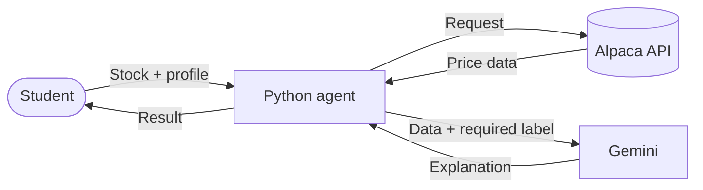
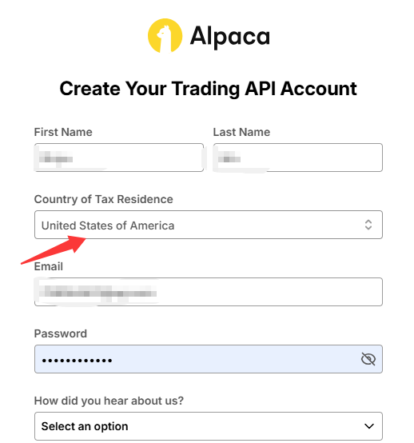
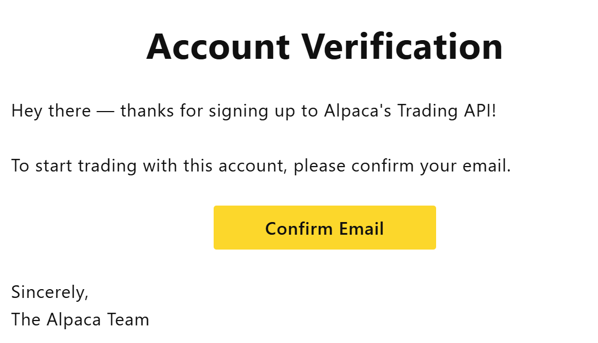
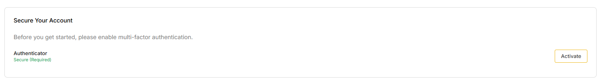
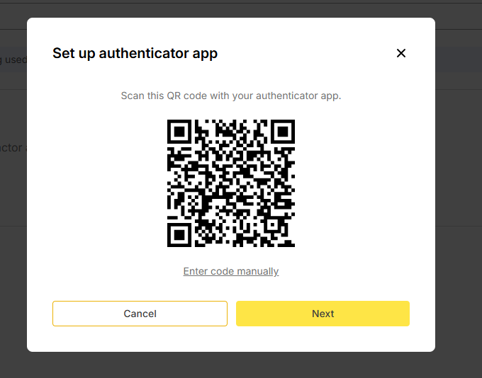
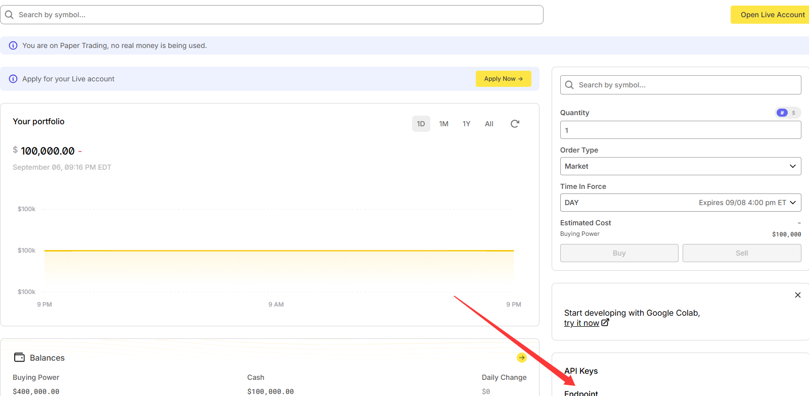
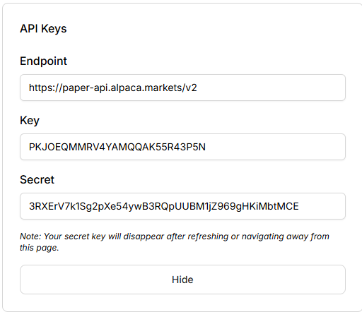

---
tags:
  - AI
  - Agent
  - Tutorial
  - INSE691
  - Stock
cssclasses:
  - clean-embeds
  - full-width
---
# Run your first AI stock agent

## INSE 691 · Foundations of AI Agent Systems

> **Fall 2026 · Concordia University · Prof. Chun Wang · No programming experience required**


- [[#What you will run|What you will run]]
- [[#Before you start|Before you start]]
- [[#Step 1: Understand the two APIs|Step 1: Understand the two APIs]]
- [[#Step 2: Configure the keys|Step 2: Configure the keys]]
- [[#Step 3: Open the project|Step 3: Open the project]]
- [[#Step 4: Run the demo|Step 4: Run the demo]]
- [[#Step 5: Try the agent|Step 5: Try the agent]]
- [[#Step 6: Stop the demo|Step 6: Stop the demo]]
- [[#Troubleshooting|Troubleshooting]]
- [[#End of tutorial|End of tutorial]]


## What you will run

This tutorial runs a small stock agent on your computer. The system:

1. gets recent US stock prices from Alpaca;
2. asks for your goal and risk tolerance;
3. calculates a teaching label: `CONSIDER`, `WAIT`, or `AVOID`;
4. asks Gemini to explain the label in plain English;
5. answers follow-up questions in a chat interface.

> [!warning] Teaching demo
> This system does not place trades or guarantee returns. Its recommendations use limited market data and are not professional financial advice.



## Before you start

You need:

- a Windows computer with internet access;
- Python 3.10 or newer;
- Visual Studio Code;
- the downloaded `beginner_stock_demo` folder.

The demo uses only the Python standard library, so you do not need to install any packages.

### Install Python and VS Code

If Python is already installed, skip to the VS Code section. VS Code gives beginners a simple place to edit and run Python files.

#### Install Python

1. Open the [official Python website](https://www.python.org/).
2. Open **Downloads** and select **Windows**. If you use another operating system, choose its download page instead.
    ![[file-20260209163908760.png|500]]
3. Choose the installer for your computer. Most Windows computers use the **64-bit installer**.
    ![[file-20260209164141288.png|500]]
4. Open the downloaded installer.

> [!attention] Add Python to PATH
> Select **Add python.exe to PATH** before starting the installation. This allows Command Prompt and VS Code to find Python.

| Select **Install Now**. Use **Customize installation** only if you need a different location. | Wait for the installation to finish. |
| ---------------------------------------------------------------------------------------------------------------------------------------------------------------------------- | -------------------------------------- |
| ![[file-20260209164407209.png]]                                                                                                                                              | ![[file-20260209164717150.png]]        |
5. Close and reopen Command Prompt, then check the installation:

    ```bat
    python --version
    ```

    If a Python version appears, the installation worked.
    ![[file-20260209164819801.png]]

#### Install VS Code

VS Code is a free code editor for opening and running this project.

1. Open the [official VS Code website](https://code.visualstudio.com/).
2. Select **Download** and choose the installer for your operating system.
    ![[file-20260209171424920.png|500]]
3. Open the installer and select **I accept the agreement**.
    ![[file-20260209171711364.png|500]]
4. Keep the default installation location, or select **Browse** to change it.
    ![[file-20260209171759400.png|500]]
5. Select **Create a desktop icon** if you want a shortcut.
    ![[file-20260209171857596.png|500]]
6. Select **Install**.
7. Open VS Code, select **Extensions** on the left, and install the **Python** extension published by Microsoft.
    ![[file-20260209172135797.png|500]]


## Step 1: Understand the two APIs

An API lets one program request data or a service from another program. This demo uses two:

| API | Job |
| --- | --- |
| Alpaca | supplies stock prices |
| Gemini | explains the recommendation |

An API key identifies the account making the request. Treat it like a password.

### Gemini API key

1. Open [Google AI Studio](https://aistudio.google.com/).
2. Sign in with your Google account and select **Get API key** in the bottom-left corner.
    ![[file-20260209220009756.png]]
3. Select **Create API key**, then give the key a name.
    ![[file-20260209220514072.png]]
4. Copy and save the key. Gemini uses it to identify your account when the demo sends a request.
    ![[file-20260209220611646.png]]

### Alpaca API credentials

1. Open [Alpaca](https://alpaca.markets/) and create an account using your real account information.



2. Confirm your email.



3. Complete the required security setup.



4. Activate an authenticator app and follow the instructions on the screen.



5. Open the paper trading dashboard and find **API Keys**.



6. Generate and save the Key ID and Secret Key.



Classroom fallback credentials

If account setup takes too long during class, you may temporarily use these instructor-provided paper account credentials:

```dotenv
ALPACA_API_KEY=PKJOEQMMRV4YAMQQAK55R43P5N
ALPACA_SECRET_KEY=3RXErV7k1Sg2pXe54ywB3RQpUUBM1jZ969gHKiMbtMCE
```

Endpoint (for reference): `https://paper-api.alpaca.markets/v2`

> [!warning]
> Use these credentials only inside this private course repository. Do not copy them into a public repository or share them outside the class. For individual practice, replace them with your own credentials.

The demo reads market data only. It does not submit orders.

> [!warning] Keep keys private
> Keep the classroom screenshots and fallback credentials inside this private course repository. Do not post your own keys in assignments, public repositories, or chat messages.

## Step 2: Configure the keys

The private course repository already includes a configured `.env.local` file. To save time in class, continue to Step 3. For individual practice, replace the shared credentials with your own.

```dotenv
ALPACA_API_KEY=your_alpaca_key
ALPACA_SECRET_KEY=your_alpaca_secret
GEMINI_API_KEY=your_gemini_key

LLM_BASE_URL=https://generativelanguage.googleapis.com/v1beta/openai
LLM_MODEL=gemini-3.5-flash-lite
ALPACA_DATA_FEED=iex
```

Make sure the file is named `.env.local`, not `.env.local.txt`.

## Step 3: Open the project

1. Open Visual Studio Code.
2. Select **File > Open Folder**.
3. Select the `beginner_stock_demo` folder.
4. Select **Terminal > New Terminal**.
5. Confirm that the main file is present:

```bat
dir simple_stock_demo.py
```

## Step 4: Run the demo

In the VS Code terminal, run:

```bat
python simple_stock_demo.py
```

You should see:

```text
Stock demo is running at http://127.0.0.1:8765
Press Ctrl+C to stop.
```

The browser should open automatically. If it does not, open [http://127.0.0.1:8765](http://127.0.0.1:8765).

Keep the terminal open while using the demo.

## Step 5: Try the agent

1. Select a stock.
2. Choose a personal goal and risk tolerance.
3. Select **Get my recommendation**.
4. Change the profile and compare the result.
5. Ask a follow-up question, such as:

```text
Which factor had the largest effect on this recommendation?
```

Notice how the agent combines Alpaca data, your profile, fixed recommendation rules, and a Gemini explanation.

## Step 6: Stop the demo

Return to the terminal and press `Ctrl+C`.

## Troubleshooting

### Python is not recognized

Close and reopen VS Code, then try `py simple_stock_demo.py`.

### Alpaca credentials are missing or invalid

Check `ALPACA_API_KEY` and `ALPACA_SECRET_KEY` in `.env.local`, then restart the demo.

### The AI assistant is unavailable

Check `GEMINI_API_KEY`, your Gemini free-tier quota, and your internet connection.

### Port 8765 is already in use

Run:

```bat
python simple_stock_demo.py --port 8766
```

Then open `http://127.0.0.1:8766`.

## End of tutorial

You have run this workflow:

```text
User profile → Alpaca data → Python calculation → Teaching policy → Gemini explanation → Validation
```
